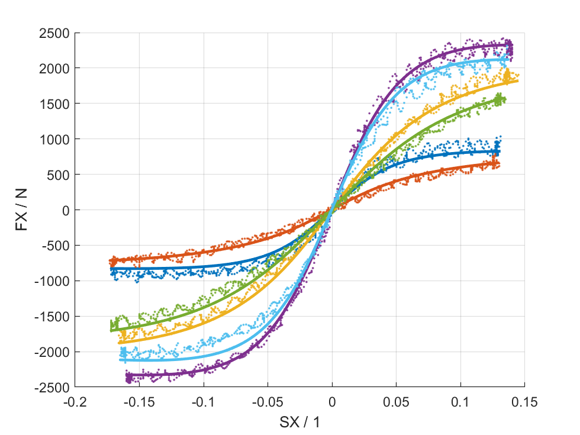

# Magic Formula Tyre Library

[](https://de.mathworks.com/matlabcentral/fileexchange/110955)
[](https://github.com/teasit/magic-formula-tyre-library/releases/latest)
[](https://github.com/teasit/magic-formula-tyre-library/releases/latest)


```matlab
[Fx,Fy] = magicformula.v62.eval(p,slipangl,longslip,inclangl,inflpres,FZW,tyreSide)
```

- Computationally efficient Magic Formula tyre model functions
- Code generation compatible
- Automatically fit Magic Formula tyre models to data
- TIR import/export (Tyre Property File format)
- TYDEX import (Tyre Data Exchange format)



## Requirements

- MATLAB Base (tested with R2021a)
- Optimization Toolbox (for fitting)
- Signal Processing Toolbox (for raw measurement import)

## Installation

There are several ways:

- Download latest Release from [MATLAB File Exchange](https://de.mathworks.com/matlabcentral/fileexchange/110955)
- Download latest Release from [GitHub](https://github.com/teasit/magic-formula-tyre-library/releases)
- Clone using Git and integrate into your projects using a [Project Reference](https://de.mathworks.com/help/simulink/ug/add-or-remove-a-reference-to-another-project.html)

## Usage and Examples

To get started with interactive examples, open the MATLAB live script
[`doc/GettingStarted.mlx`](./doc/GettingStarted.mlx) in your editor.

You can find further examples in the  [`doc/examples`](./doc/examples) folder.

I also created an open-source GUI application in MATLAB for interactive fitting
of Magic Formula tyre models to measurement data.
It uses this library as a submodule, meaning that fitted parameter sets with the GUI can
be used with the equations provided by this CLI library.
You can find it here:
[Link to GUI](https://github.com/teasit/magic-formula-tyre-tool)!

## Motivation

The project was motivated by my work in the Formula Student Team
[UPBracing](https://formulastudent.uni-paderborn.de/en/). As I required
a performant, easy-to-use and precise implementation of the Magic Formula,
and existing implementations were not satisfactory (either being commercialized
and therefore without source or [very slow](https://de.mathworks.com/matlabcentral/fileexchange/63618-mfeval)),
it made sense to make my own version.

This library is currently used in the team's Torque-Vectoring
algorithms and all vehicle-modeling applications. Therefore the model
evaluation functions are suitable for code-generation and have actually
proven to be only moderately slower than linear tire models.

I hope this project benefits some students passionate about Vehicle Dynamics.
If you have any questions, don't hesitate to contact me! I will try and keep this
project updated in the future. If you want to contribute, please do. But I
must warn you, I am still new to publishing code as open-source and do not yet
know the ins and outs of working collaboratively on GitHub.

This project would not have been possible without the data provided by the
[Formula SAE Tire Test Consortium (FSAE TTC)](https://www.millikenresearch.com/fsaettc.html)
and the
[Calspan Tire Testing Research Facility (TIRF)](https://calspan.com/automotive/fsae-ttc).
De-identified and obscured test data has been used in examples and images or recordings
of the application, to conform to the
[license agreement](https://www.millikenresearch.com/FSAE_TTC_agreement.pdf).
Special thanks to Dr. Edward M. Kasprzak for granting me permission to provide the used,
de-identified and obscured data for demonstration purposes.

## Known Issues, Notes and Bugs

- Currently only Magic Formula version 6.1.2 (62) is implemented
- Of v6.1.2 the turn slip parameters have been reduced to constant parameters
  (noted by greek letter zeta in Pacejka's book). To remove the influence of
  these parameters, simply set them to unity (=1). The default parameter
  set automatically applies unity. This effectively ignores turn slip.
- Equations (4.E7) and (4.E8) are ignored (velocity-dependent scaling of
  friction coefficient) to remove dependency on speed as input. Might be
  added as an alternative implementation in the future.
- In some sub-equations a few scaling factors were not implemented
- Self-aligning torque is not calculated/implemented (MZW).
