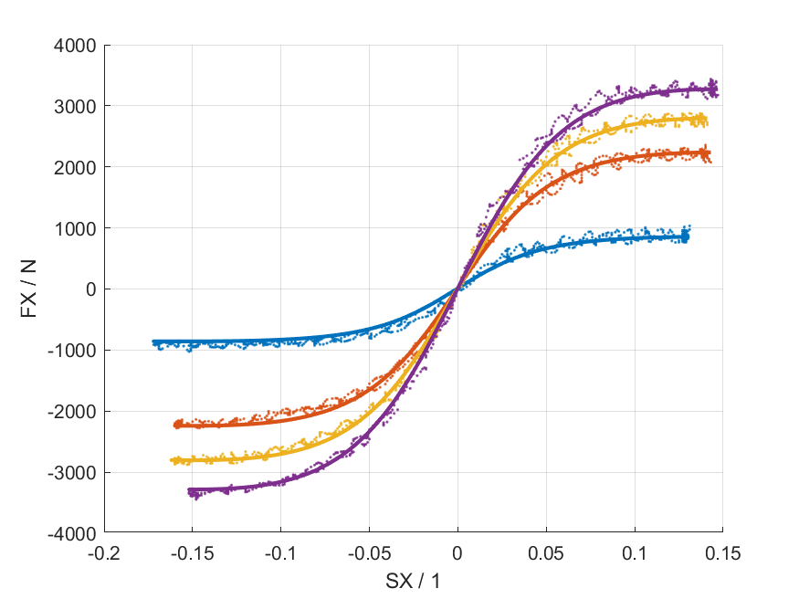
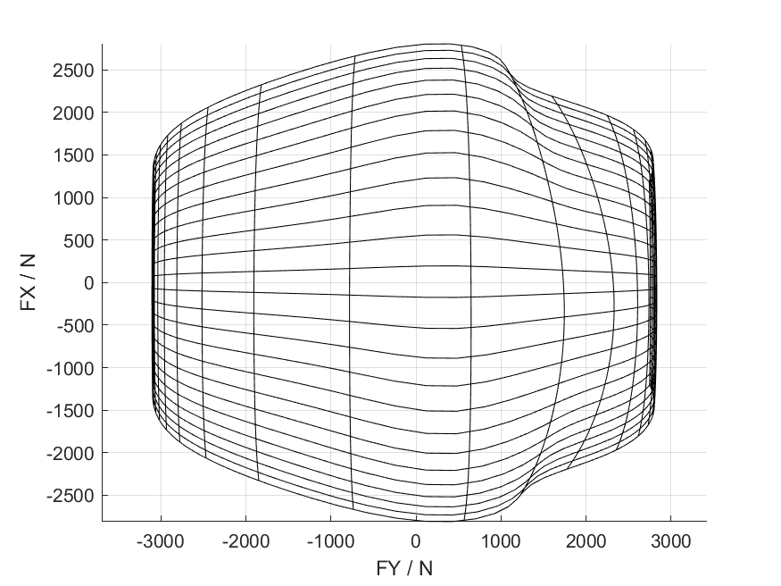

# Magic Formula Tyre Library

[](https://de.mathworks.com/matlabcentral/fileexchange/110955)
[](https://github.com/teasit/magic-formula-tyre-library/releases/latest)
[](https://github.com/teasit/magic-formula-tyre-library/actions/workflows/test-matlab-r2023b.yml)



```matlab
[FX,FY,MZ,MY,MX] = magicformula(params,__)
```

- Computationally efficient
- Code generation compatible
- Automated fitting to data
- TIR (*.tir) import/export
- TYDEX (*.tdx) import/export

## Requirements

- MATLAB Base
- (Optional) Optimization Toolbox (fitting)
- (Optional) Parallel Computing Toolbox (parallel fitting)

### Release Compatibility

- [](https://github.com/teasit/magic-formula-tyre-library/actions/workflows/test-matlab-r2023b.yml)
- [](https://github.com/teasit/magic-formula-tyre-library/actions/workflows/test-matlab-r2022b.yml)
- [](https://github.com/teasit/magic-formula-tyre-library/actions/workflows/test-matlab-r2021b.yml)
- [](https://github.com/teasit/magic-formula-tyre-library/actions/workflows/test-matlab-r2020b.yml)

## Installation

- Download from [MATLAB File Exchange](https://de.mathworks.com/matlabcentral/fileexchange/110955)
- Download from [GitHub](https://github.com/teasit/magic-formula-tyre-library/releases)
- Clone and integrate into your MATLAB projects as a [Project Reference](https://de.mathworks.com/help/simulink/ug/add-or-remove-a-reference-to-another-project.html)

## Usage and Examples

See [`GettingStarted.mlx`](./doc/GettingStarted.mlx) to get started. If you install
the library as a toolbox, you will be prompted to open said Live Script. It contains
an overview of the library and is the recommended way to get started.

### Example: Model vs. Data

This code generates the title figure of this README. Either clone the library or install
it as a toolbox and try it yourself. You can download the example data
[here](https://github.com/teasit/magic-formula-tyre-library/tree/main/doc/examples/fsae-ttc-data).
The data has been de-identified to conform with the FSAE TTC's
[license agreement](https://www.millikenresearch.com/FSAE_TTC_agreement.pdf).

```matlab
parser = tydex.parsers.FSAETTC_SI_ISO_Mat();
measurements = parser.run('doc/examples/ttc/drivebrake.mat');
tyre = MagicFormulaTyre('doc/examples/ttc/obfuscated.tir');
figure(); grid on; hold on
magicformula.plots.compareFxSX(tyre, measurements(2:5))
```


### Example: Friction Ellipse

Also known as the Kamm-Circle when approximating the tire friction limit as a circle when it actually is an ellipse.

```matlab
tyre = MagicFormulaTyre('doc/examples/ttc/obfuscated.tir');
figure(); grid on; hold on
magicformula.plots.kamm(tyre)
```



Further examples can be found in the  [`doc/examples`](./doc/examples) folder.

## Motivation

The project was motivated by my work in the Formula Student Team
[UPBracing](https://formulastudent.uni-paderborn.de/en/). My goal was to create an
easy-to-use MATLAB library for other students to use in their vehicle dynamics projects.

This project would not have been possible without the data provided by the
[Formula SAE Tire Test Consortium (FSAE TTC)](https://www.millikenresearch.com/fsaettc.html)
and the
[Calspan Tire Testing Research Facility (TIRF)](https://calspan.com/automotive/fsae-ttc).
De-identified and obscured test data has been used in examples and images or recordings
of the application, to conform to the
[license agreement](https://www.millikenresearch.com/FSAE_TTC_agreement.pdf).
Special thanks to Dr. Edward M. Kasprzak for granting me permission to provide the used,
de-identified and obscured data for demonstration purposes.

## Known Issues

- Currenlty only version 6.1.2 (61) is implemented
- Turnslip is ignored
